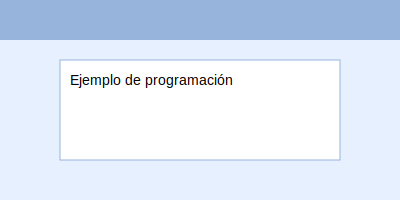
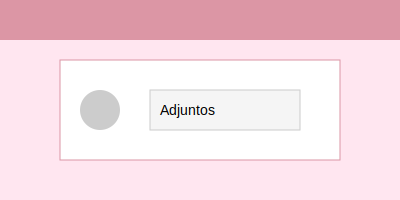
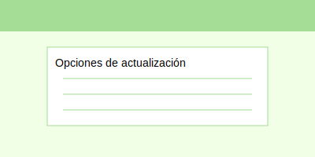

# 🚀 WATOOLX - Sistema de Tickets con WhatsApp

## 📋 Descripción

**Watoolx** es una plataforma SaaS completa para la gestión de tickets de atención via WhatsApp y con sincronización a inteligencia artificial integrada. Desarrollada con tecnologías modernas y optimizada para producción.

## ✨ Características Principales

### 🤖 **Inteligencia Artificial**
- ✅ Agentes IA conversacionales automáticos
- ✅ Transferencias inteligentes entre departamentos
- ✅ Manejo de opciones inválidas
- ✅ Prompts optimizados en español
- ✅ Extracción automática de códigos YouTube

### 📱 **WhatsApp Integration**
- ✅ Integración completa con WhatsApp
- ✅ Campos personalizados (waName, Avatar, Token, Instance)
- ✅ Gestión de sesiones múltiples
- ✅ QR Code automático

### 🎯 **Gestión de Tickets**
- ✅ Sistema completo de tickets
- ✅ Transferencias automáticas entre departamentos
- ✅ Gestión de tickets huérfanos
- ✅ Sistema de colas inteligente
- ✅ Asignación automática de agentes

### 🎨 **Interfaz de Usuario**
- ✅ Diseño moderno y responsive
- ✅ Traducciones completas en español
- ✅ Versión dinámica del sistema
- ✅ Títulos personalizables
- ✅ Modo oscuro/claro

### 🔧 **Tecnologías**
- **Backend**: Node.js, TypeScript, Express, Sequelize
- **Frontend**: React, Material-UI, Socket.io
- **Base de Datos**: MySQL
- **Cache**: Redis
- **IA**: OpenAI Integration
- **WhatsApp**: Baileys Library

## 🚀 Instalación Rápida 10 a 15mim

### Prerrequisitos
- Node.js 20+
- MySQL 8.0+
- Redis 6.0+
- Git

### Pasos de Instalación

```bash
# 1. Clonar el repositorio
git clone https://github.com/leopoldohuacasiv/sturt-wha-icket.git
cd sturt-wha-icket

# 2. Instalar dependencias
cd backend && npm install
cd ../frontend && npm install

# 3. Configurar variables de entorno
cp backend/env.example backend/.env
cp frontend/env.example frontend/.env

# 4. Configurar base de datos
# Editar backend/.env con tus credenciales de MySQL

# 5. Ejecutar migraciones
cd backend
npm run build
npx sequelize db:migrate
npx sequelize db:seed:all

# 6. Iniciar servicios
npm start  # Backend
cd ../frontend && npm start  # Frontend
```

## ⚙️ Configuración

### Variables de Entorno - Backend
```env
NODE_ENV=development
PORT=8080
FRONTEND_URL=http://localhost:3000

# Base de datos MySQL
DB_DIALECT=mysql
DB_HOST=localhost
DB_PORT=3306
DB_NAME=waticket_saas
DB_USER=root
DB_PASS=tu_password

# Configuración de logging
DB_DEBUG=false
LOG_LEVEL=info

# Redis
REDIS_URI=redis://localhost:6379

# JWT
JWT_SECRET=tu_jwt_secret_muy_seguro

# Upload
UPLOAD_DIR=./public/uploads
```

### Variables de Entorno - Frontend
```env
REACT_APP_BACKEND_URL=http://localhost:8080
```

## 🎯 Funcionalidades Destacadas

### 🤖 **Sistema de IA Conversacional**
- Respuestas automáticas inteligentes
- Transferencias basadas en contenido
- Manejo de contextos complejos
- Integración con OpenRouter Multi IA

### 🔄 **Transferencias Automáticas**
- Transferencias entre departamentos
- Reglas de negocio configurables
- Historial de transferencias
- Notificaciones automáticas

### 📊 **Dashboard Avanzado**
- Métricas en tiempo real
- Gráficos interactivos
- Reportes detallados
- Exportación de datos

### 👥 **Gestión de Usuarios**
- Roles y permisos
- Autenticación JWT
- Perfiles personalizables
- Auditoría de acciones

## 📆 Programaciones Recurrentes

Watoolx permite definir tareas programadas que se ejecutan de forma automática. Es ideal para recordatorios o mensajes periódicos.

**Parámetros principales:**
- `frecuencia`: diaria, semanal o mensual.
- `hora`: formato HH:MM en 24 horas.
- `dias`: lista de días de la semana (cuando aplica).
- `activo`: habilita o deshabilita la programación.

```json
{
  "tarea": "Recordatorio de pago",
  "frecuencia": "semanal",
  "dias": ["lunes", "jueves"],
  "hora": "09:00",
  "activo": true
}
```



## 📨 Envío de Mensajes con Multimedia

Los mensajes pueden incluir imágenes, documentos o audio. Se admite una lista de archivos para enviar varios adjuntos en un solo mensaje.

```json
{
  "numero": "+51999999999",
  "mensaje": "Hola, adjunto los documentos solicitados",
  "archivos": [
    "./docs/contrato.pdf",
    "./imagenes/foto1.jpg"
  ]
}
```



## 🔄 Módulo "Actualizar"

El módulo **Actualizar** mantiene la instancia al día sin tareas manuales. Incluye las siguientes opciones:

- `sistema`: descarga la última versión del código.
- `dependencias`: instala o actualiza paquetes de backend y frontend.
- `base-datos`: ejecuta migraciones pendientes.
- `reiniciar`: reinicia los servicios tras la actualización.

Ejemplo de uso:

```bash
npm run actualizar -- --modo sistema
```



## 🚀 Despliegue en Producción

### Usando el Script Automático
```bash
# Ejecutar script de configuración
chmod +x install.sh
./install.sh
```

Después de la instalación, puedes comprobar si existen nuevas versiones con:

```bash
check-updates.sh
```

### Configuración Manual
1. **Configurar servidor VPS** con Ubuntu 22+
2. **Instalar dependencias**: PM2, Nginx, MySQL, Redis
3. **Configurar SSL** con Let's Encrypt
4. **Configurar firewall** y seguridad
5. **Activar monitoreo** y backups

## 📁 Estructura del Proyecto

```
watoolx/
├── backend/                 # API REST + WebSocket
│   ├── src/
│   │   ├── controllers/     # Controladores de la API
│   │   ├── models/         # Modelos de base de datos
│   │   ├── services/       # Lógica de negocio
│   │   ├── routes/         # Rutas de la API
│   │   └── utils/          # Utilidades
│   ├── database/
│   │   ├── migrations/     # Migraciones de BD
│   │   └── seeds/         # Datos iniciales
│   └── ecosystem.config.js # Configuración PM2
├── frontend/               # Aplicación React
│   ├── src/
│   │   ├── components/     # Componentes React
│   │   ├── pages/         # Páginas de la app
│   │   ├── services/      # Servicios de API
│   │   └── utils/         # Utilidades
│   └── public/            # Archivos estáticos
├── guias/                 # Documentación técnica
├── setup/                 # Scripts de instalación
└── README.md             # Este archivo
```

## 🔧 Comandos Útiles

### Desarrollo
```bash
# Backend
npm run dev        # Desarrollo con nodemon
npm run build      # Compilar TypeScript
npm run migrate    # Ejecutar migraciones
npm run seed       # Ejecutar seeders

# Frontend
npm start          # Desarrollo
npm run build      # Compilar para producción
```

### Producción
```bash
# PM2
pm2 start ecosystem.config.js
pm2 restart all
pm2 logs

# Nginx
sudo nginx -t
sudo systemctl reload nginx

```

## 📊 Estado del Proyecto

### ✅ **Completado (100%)**
- Sistema de tickets completo
- Sincronización con WhatsApp
- IA conversacional OpenRouter
- Transferencias automáticas con IA
- Interfaz de usuario moderna
- Sistema de logging optimizado
- Configuración de producción

### 🚀 **Listo para Producción**
- Optimizaciones de performance
- Configuraciones de seguridad
- Scripts de despliegue
- Documentación completa

## 📄 Licencia

Este proyecto está bajo la Licencia MIT. Ver el archivo `LICENSE` para más detalles.

## 📞 Soporte

- **WhatsApp**: +51936450940
- **Documentación técnoca**: [Guias técnicas](./guias/)
- **Issues**: [GitHub Issues](https://github.com/leopoldohuacasiv/sturt-wha-icket/issues)

## 🎯 Roadmap

### Próximas Funcionalidades
- [ ] Analytics avanzados
- [ ] Integración con CRM
- [ ] API pública
- [ ] Múltiples idiomas
- [ ] App móvil

---

**Versión**: 1.1.0  
**Última actualización**: 31 de Julio 2025  
**Estado**: ✅ Listo para producción  
**Autor**: Leopoldo Huacasi